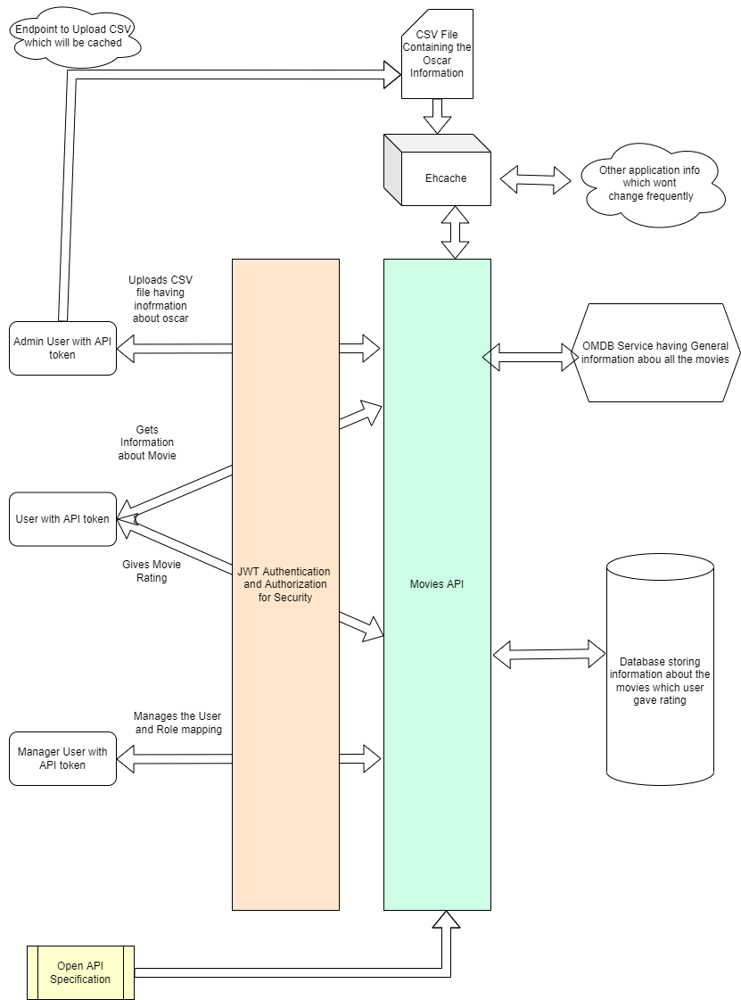
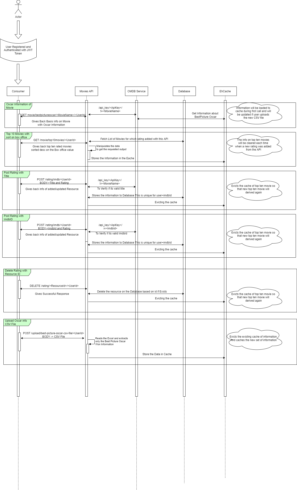
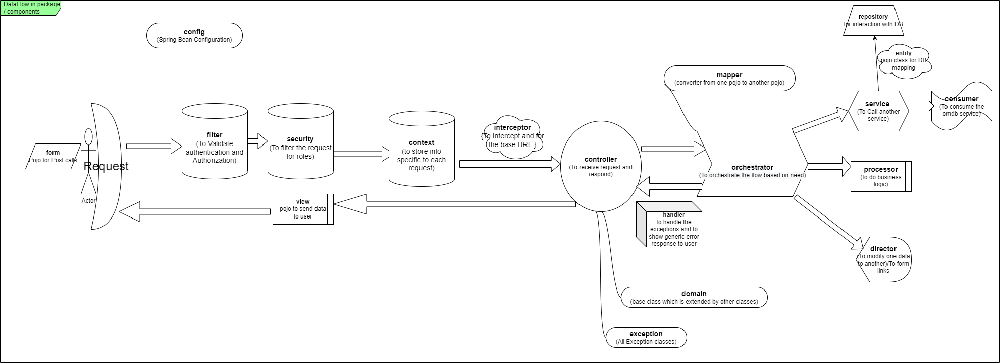
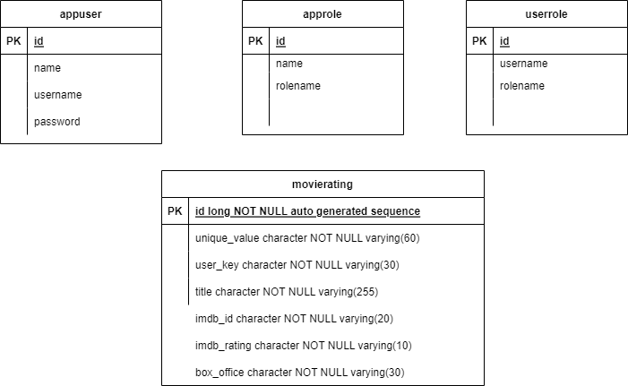
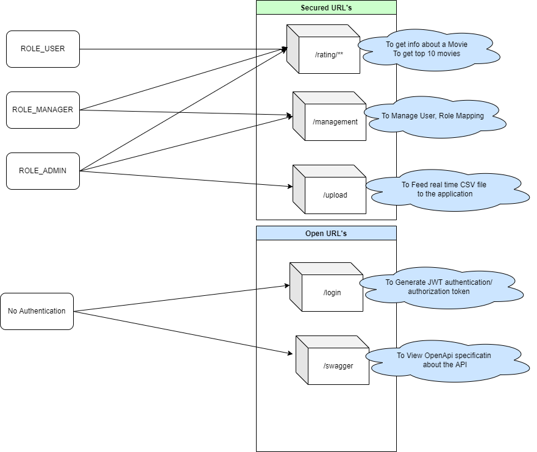

### Standards
* Followed all  Richardson Rest maturity models(Verb, Resource, Link) to maintain the API standard
* Secure the API with JWT authentication and Authorization
* Hateoas links introduced for the easy visibility of what next steps the user can do!
* Separate configuration and property file for Test and Live
* Naming convention to be consistent for easy maintainability

### Scale up option
* Should components should be Deployable in Docker/Kubernetes
* Option to deploy Api and Database as separate containers or in single container
* Kubernetes implementation to scale up and scale down based on the need

### Better performance
* Cache data whenever possible so that performance will be improved
* Evict the cache at proper place and time so that data will be consistent and real time
* Option to upload CSV file so that no need of application restart when there is a change in CSV data

### Quality and Documentation
* Swagger implementation for increase readability of the API
* Unit testing for code quality
* Integration testing to make sure the application is stable all the times

****

### Folders And Whats Inside

[Coverage Report](../CodeCoverageITandUnitTest)

[UML Diagrams](../Diagrams)

[Docker and K8s running information](.../DockerImagesAndKubernetes)

[Source Code](../MoviesApiAssignment)

[Postman collection](../Postman_testing_collection)

[md file Documentation](../ReadMe_md)

[Unit Test and Integration Test Coverage](../CodeCoverageITandUnitTest/surefire-report.html)

[Swagger Report](../SwaggerReport)

[Swagger URL](http://localhost:8080/swagger-ui/index.html)

****

### You can Use the below Diagrams to undersand the application,

